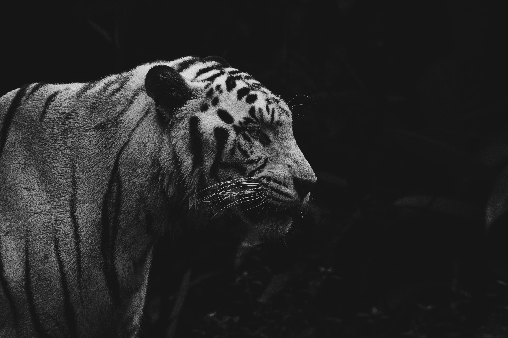
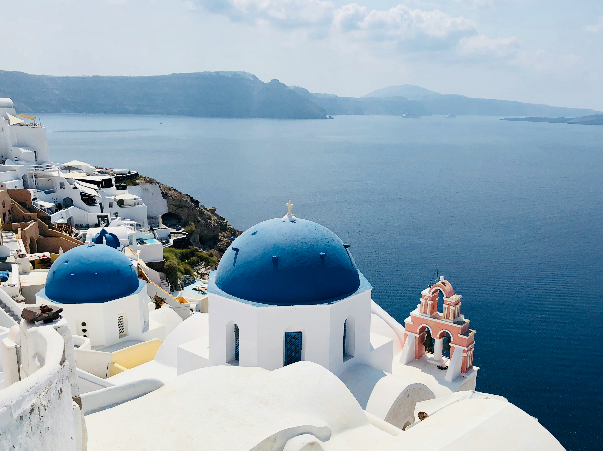
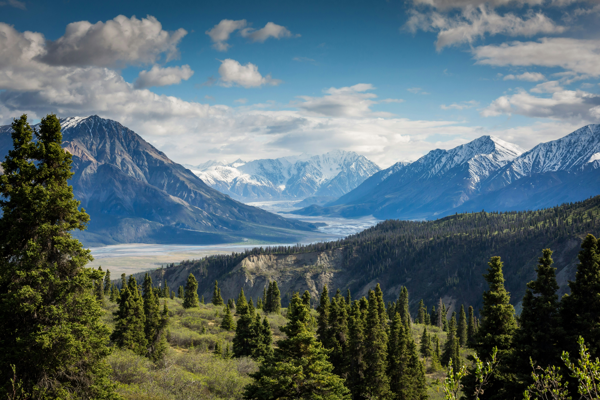
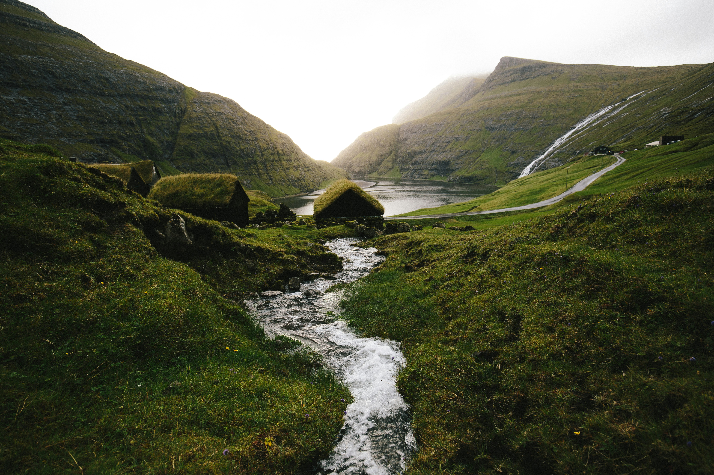
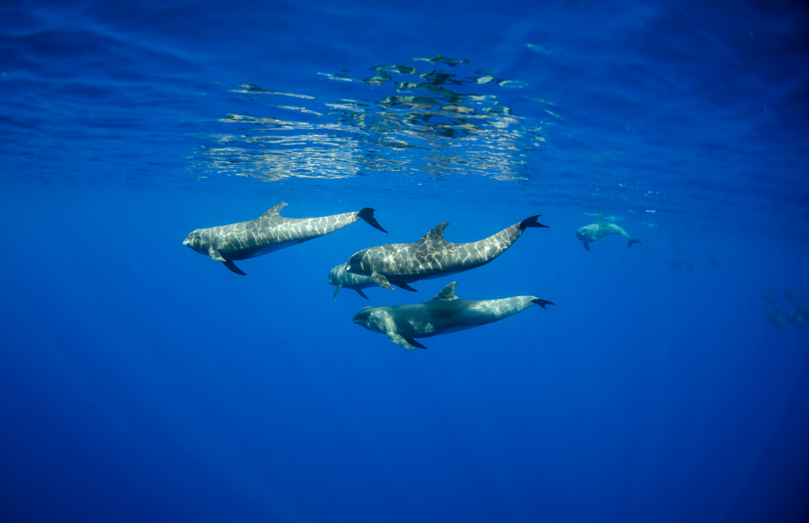
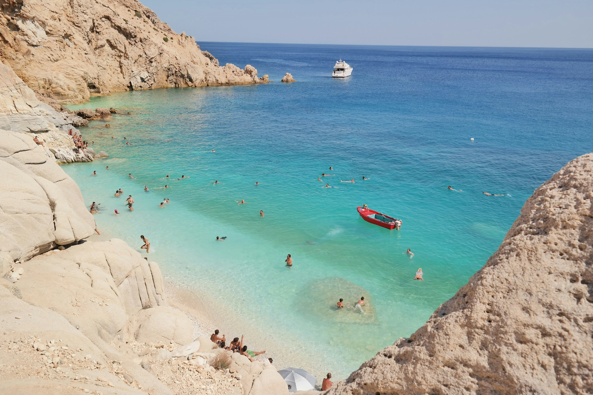

# 🖼 Wallpapers
A collection of **high-quality 4K aesthetic wallpapers**. Perfect for desktops, backgrounds, and inspiration!

### 🚀 This repository updates **wallpapers every week**.
#### Why?
- Perfect for people who like to **change their wallpaper daily** → 16 wallpapers for a week = 2/3 per day
- Keeps the repo size small.

## Get all wallpapers
```sh
git clone --depth 1 https://github.com/phucisstupid/wallpapers
```

## Update wallpapers
Run this to always get the latest wallpapers:

```sh
git fetch origin && git reset --hard origin/main
```

## Gallery

💡 Tip: Click on any image to view full-size. Enjoy your wallpapers!

<table>
<tr>
<td><a href="./alicia-chong-w5dsoP-W-aw-unsplash.jpg"></a></td>
<td><a href="./bjorn-snelders-Cd3Ek7rNXSk-unsplash.jpg"></a></td>
<td><a href="./christopher-politano-ySUFHMW1hc4-unsplash.jpg"></a></td>
<td><a href="./clem-onojeghuo-jNx7P5a8DpE-unsplash.jpg"></a></td>
</tr><tr>
<td><a href="./dan-MdTtpxGlrz8-unsplash.jpg"></a></td>
<td><a href="./james-donaldson-toPRrcyAIUY-unsplash.jpg"></a></td>
<td><a href="./kalen-emsley-Bkci_8qcdvQ-unsplash.jpg"></a></td>
<td><a href="./lewis-j-goetz-JbWg7W953LY-unsplash.jpg"></a></td>
</tr><tr>
<td><a href="./lucas-benjamin-R79qkPYvrcM-unsplash.jpg"></a></td>
<td><a href="./marc-zimmer-yktwU2t1qHA-unsplash.jpg"></a></td>
<td><a href="./massimo-virgilio-xi4H7Z9MDfA-unsplash.jpg"></a></td>
<td><a href="./meditations-raven.png"></a></td>
</tr><tr>
<td><a href="./noaa-AQx2VH2731k-unsplash.jpg"></a></td>
<td><a href="./shifaaz-shamoon-QwhQR_kF0AQ-unsplash.jpg"></a></td>
<td><a href="./torsten-dederichs-WRrGflm_Umo-unsplash.jpg"></a></td>
<td><a href="./vasiliki-theodoridou-5hwgNSho-gA-unsplash.jpg"></a></td>
</tr><tr>
</tr></table>
